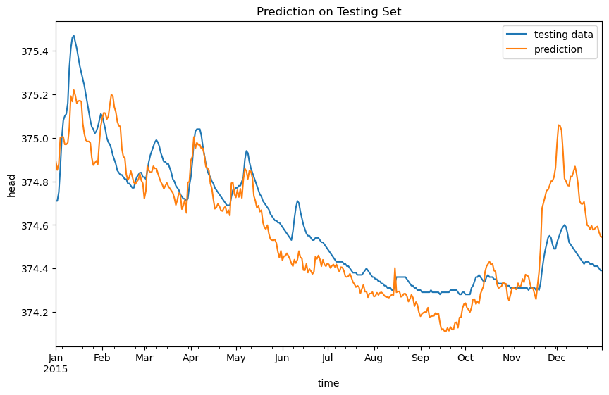
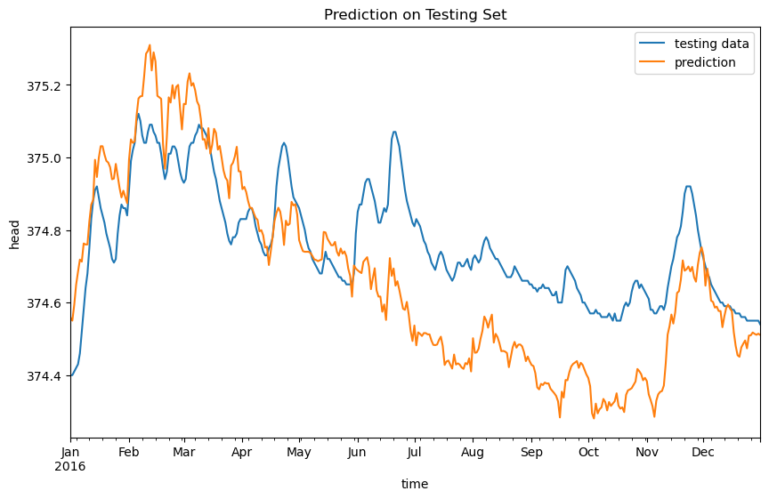
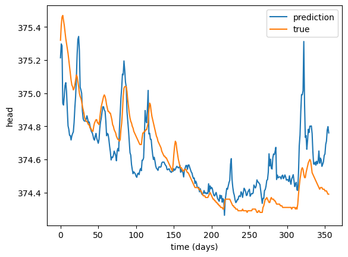
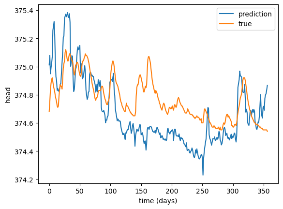

# Challenge Description:

## Overview

This repo is based on our team's submission for the groundwater time series modeling challenge. The goal of this challenge is to predict the groundwater level over a period of time using meteorological data. The constraint is that we are not allowed to use groundwater levels from previous time points to make predictions. The project was submitted in 2023, but I recently upraded our original code to include an LSTM model (still in progress), and also made our code more modular. 

There are three main notebooks:
- [Exploratory Data Analysis](Germany_EDA.ipynb)
- [Original ML model](Germany_prediction.ipynb)
- [LSTM model](Germany_prediction_LSTM.ipynb)

## Author(s)

- Xinyue (Selina) Wang (Brown University DSI)
- Yang Zheng (Brown University DSI)

## Location description

The well is situated in Bavaria, in the Upper Jurassic Malm Karst aquifer. It is a deep, confined aquifer (partly artisian), which is overlain by a local alluviual aquifer in a small river valley. Surface elevation is about 375 masl, depth to groundwater 0.9 m on average.

## Model workflow

### [Original ML approach]((Germany_prediction.ipynb)):
1. We performed [Exploratory Data Analysis](Germany_EDA.ipynb) to understand the distribution and seasonality of feature variables, remove highly correlated features, and gain insights for feature engineering.
2. For feature engineering, we created two types of features:
     - lags of feature variables
     - features that encode the time of year and time of month signals
3. For data preprocessing, we standardized all the continuous features and used a onehot encoding to encode the categorical features.
4. We chose the Mean Squared Error (MSE) as our evaluation metric because it penalizes extreme values and large errors more heavily, which is suitable for this application as we are most interested in the extreme highs and lows of ground water level.
5. We tried three different models: linear regression with regularization (lasso), Support Vector Machine (SVR), and a Random Forest Regressor, as well as a baseline model that predicts the average water level for each day.
6. Our data splitting strategy is a bit complicated. We split our data into training, validation and test sets, keeping these three sets in chronological order so as to avoid information leakage since we do not want to be using future information to make predictions about past data. For each algorithm, we trained the model on the training set, used the validation set to choose the est set of hyperparameters, and then predicted on the test set to calculate the test MSE score. We repeated this procedures for 5 iterations, for each iteration, we expand the training set by one year, and shift out the validation and test sets by one year, so that each algorithm is being evaluated on 5 different test sets. This gives 5 different models and 5 different MSE test scores for each ML algorithm. We perform these iterations to account for uncertainties in our model results and better evaluate each algorithm's performance on different testing periods.
7. We choose the model with the lowest mean MSE test score as our best model. In our case it turned out to be the SVR model with a mean MSE of 0.027! the SVR had a lower MSE score and also was relatively quck to compute.
8. We then used these 5 models to produce 5 predictions on the submission dataset, and used these to construct the mean prediction and 95% prediction intervals for submission. 

Average MSE: 0.027

Prediction on two different test sets (years 2015 and 2016):

Below is our final prediction for submission:

### [LSTM approach](Germany_prediction_LSTM.ipynb):
1. I performed EDA and feature engineering similarly to how it was done in our original approach, two key differences are:
   -  Instead of adding lags of features, I decided to incorporate past data into my LSTM architecture by letting it learn from a sequence of the past 30 days of meterlogical data and predict one day of water level.
   - I also experimented with a different way of encoding the time of year signal by transforming it into sine and cosine waves to capture the cyclical pattern.
2. For splitting, I peformed a simple splitting of train - validation - test sets in chronological order, where the validation and test sets each consist of one year of data.
3. future work: ...

The MSE on the validation (year 2015) and test (year 2016) sets are 0.042 and 0.032 respectively. Below are the prediction results on the validation and test sets.

### Points of improvement:
- in depth analysis of the cyclical pattern of meterological data to decide the lags / number of time steps to look back to for LSTM
- tune parameters for LSTM model
- other feature engineering ideas incorporating domain knowledge

## Supplementary information

### Input data description

The following input data are provided to model the head time series. This data were collected from the E-OBS dataset 
v25.0e at 0.1deg grid size.

- Daily Precipitation (RR) in mm/d.
- Daily mean temperature (TG) in degree Celsius.
- Daily minimum temperature (TM) in degree Celsius.
- Daily maximum temperature (TX) in degree Celsius.
- Daily averaged sea level pressure (PP) in hPa.
- Daily averaged relative humidity (HU) in %.
- Daily mean wind speed (FG) in m/s.
- Daily mean global radiation (QQ) in W/m2.
- Potential evaporation (ET) computed with Makkink in mm/d.

### Calibration and testing data

The head data are split into a training and testing period. Data are provided for the training/calibration period. Participants have to provide a simulated time 
series for the entire period:

- **Training period:** 2002-05-01 to 2016-12-31
- **Testing period:** 2017-01-01 to 2021-12-31

